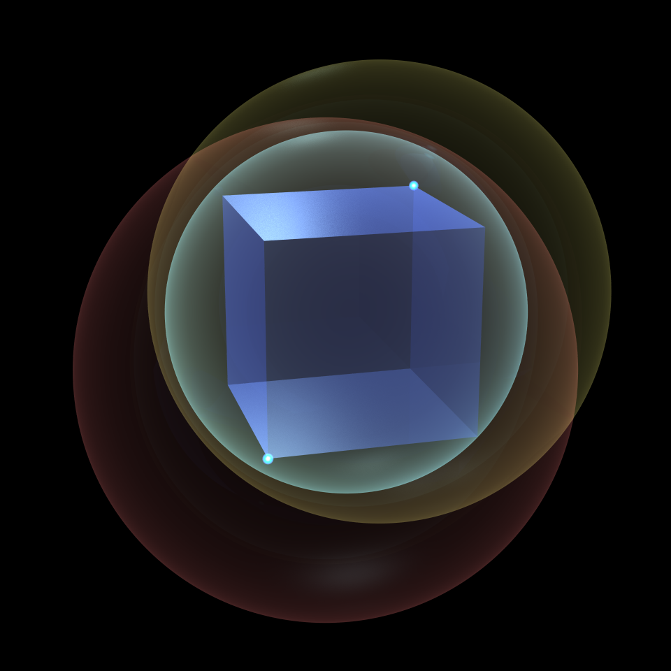

# Benchmarking GeoFit

For benchmarking I coded a couple of aditional things into the the package:
- The Ritter's algorithm as a Java class of it's own
- An AABB-center based method called `fastSphere()` in the `GeoFit`-class 

They both are so called two-pass algorithms. 

The implementation of Ritter's algorithm has two modes, that affect the behavior first pass: It keeps either the first found or the last found point with the same coordinate value when it is selecting the points of th einitial sphere. The implementation is adapted to work vith vectors instead of indivisual coordinate values. There is no real benefit in using vectors as the algorithm does not use any of the most powerful vector functions. It just happens to be handy. 

The `GeoFit.fastSphere()` method is actually the two first passes of the `GeoFit.boundingSphere()` procedure. It produces a non-minimal enclosing sphere. Sometimes it may produce a perfect fit but the algrothm does not check that.

The processing times reported below are the actual solver times. Invoking the tool, preparing the data and constructing the BoundingSphere-object are not included. The times are averages of several repetitions but still only represent a somewhat typical result. Relative variation of time consumption is huge especially in faster cases.

## Cases
<table>
  <tr>
    <th></th>
    <th colspan = 4>Lucy-Angel</th>
  </tr>
  <tr>
    <th></th>
    <td colspan = 4></td>
    <td colspan = 4></td>
  </tr>
  <tr>
    <th align = left>Vertices</th>
    <td colspan = 4, align = center>224 445</td>
   <td colspan = 4, align = center>8</td>
  </tr>
  <tr>
    <th align = left>Box dimensions</th>
    <td colspan = 4, align = center>2.949 x 8.546 x 4.629</td>
   <td colspan = 4, align = center>2.000 x 2.000 x 2.000</td>
  </tr>

  <tr>
    <th align = left>Algorithm</th>
    <th>Time ms</th><th>Passes</th><th>Supports</th><th>Radius</th>
    <th>Time &mus</th><th>Passes</th><th>Supports</th><th>Radius</th>
  </tr>
  <tr>
    <td>GeoFit</th>
    <td>14.066</td><td align = center>6</td><td align = center>4</td><td>4.670</td>
    <td>0.211</td><td align = center>4</td><td align = center>2</td><td>1.732</td>
  </tr>
  <tr>
    <td>AABB</td>
    <td>5.806</td><td align = center>2</td><td></td><td>4.918</td>
    <td>0.122</td><td align = center>2</td><td></td><td>1.732</td>
  </tr>
  <tr>
    <td>Ritter F</td>
    <td>5.114</td><td align = center>2</td><td></td><td>5.086</td>
    <td>0.197</td><td align = center>2</td><td></td><td>2.341</td>
  </tr>
  <tr>
    <td>Ritter L</td>
    <td>4.864</td><td align = center>2</td><td></td><td>5.086</td>
    <td>0.157</td><td align = center>2</td><td></td><td>2.154</td>
  </tr>
</table>

## References

Lucy-Angel: https://free3d.com/3d-model/angel-lucy-sculpture-46454.html
